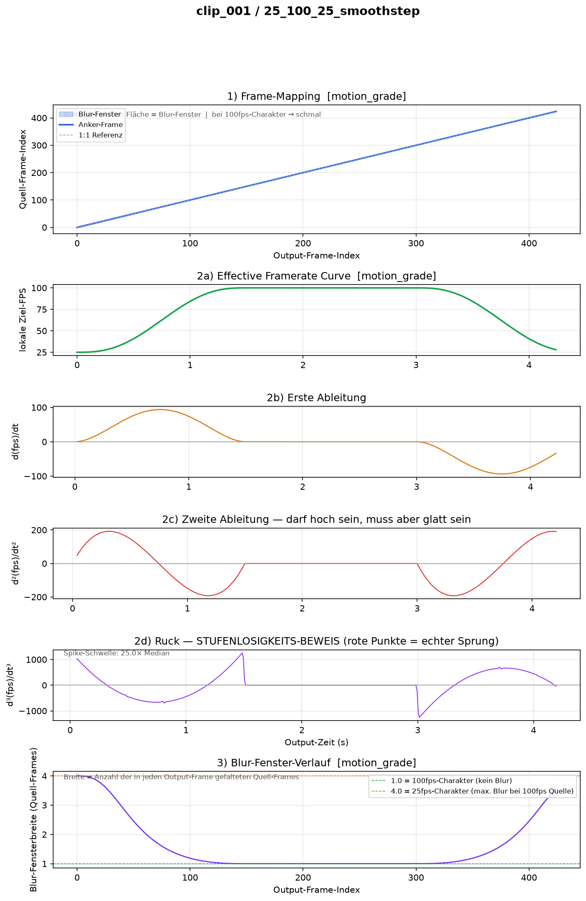

# Motion Grading Pipeline
### Framerate-Ramp-Processing für 100fps-Filmmaterial bei konstanter Zeitachse

**HDM Stuttgart — Masterprojekt Cinematography**
Simon Hans · Betreuer: Jan Fröhlich, Stefan Grandinetti

---

## Transparenzhinweis zur Entwicklungsmethode

Dieses Projekt wurde im Rahmen meines Masterprojekts an der HdM Stuttgart entwickelt. Für die Implementierung der Pipeline — d.h. die Generierung und das iterative Debugging des Python-Codes — habe ich intensiv mit dem Large Language Model Claude (Anthropic, Modell: Claude Sonnet 4.6) zusammengearbeitet. Sämtliche konzeptionellen Entscheidungen (Problemdefinition, Wahl der mathematischen Interpolationsmethode, visuelle Verifikationsstrategie usw.) wurden von mir  entwickelt und mit dem Modell diskutiert. Der Code entstand im Dialog, wurde von mir in jeder Iteration inhaltlich geprüft, gegen echtes Filmmaterial getestet und bei Fehlern gezielt korrigiert.

Dieses Repository dokumentiert einen **funktionierenden Proof-of-Concept** an einem kurzen Testclip (~4 Sekunden, 100fps). Die Pipeline ist für den Einsatz auf dem vollständigen Kurzfilm-Quellmaterial (ca. 250 GB, 100fps) ausgelegt, wurde in dieser Gesamtskala aber noch nicht vollständig durchgeführt.

---

## Motivation & Problemstellung

Ein harter Schnitt zwischen flüssigem 100fps-Material und klassischem 25fps-Look reißt den Zuschauer aus der Immersion. Der Sprung von gestochen scharfen, hochfrequenten Bewegungen (kurze Belichtungszeit) zu weichem, filmischem Motion Blur irritiert das Auge.

Dieses Projekt löst das Problem durch Motion Grading. Die Pipeline verschleiert den Übergang zwischen HFR- und 25fps-Material, indem sie den Shutter-Charakter des Footage dynamisch und stufenlos anpasst, ohne die Abspielgeschwindigkeit zu verändern. Das Ergebnis ist ein unsichtbarer, natürlicher Wechsel – als würde die Kamera während der Einstellung fließend ihren Shutter-Winkel ändern.


## Technischer Ansatz

### Kernidee: Frame-Hold mit Blur-Compositing

Da der Output-Container mit 100fps läuft, entspricht jeder Output-Frame genau einem Quell-Frame-Zeitpunkt (1:1-Mapping). Der Motion-Grading-Effekt entsteht durch zwei Mechanismen pro Output-Frame:

1. Blur-Compositing (Shutter-Integral): Statt eines einzelnen scharfen Quell-Frames werden N RIFE-interpolierte Sub-Samples innerhalb eines virtuellen Shutter-Fensters gemittelt. Die Breite dieses Fensters (in Quell-Frames) ist `source_fps / local_target_fps`. Bei simulierten 25fps werden 4 Quell-Frames zu einem belichteten Composite gefaltet — physikalisch das Äquivalent eines 360°-Shutters bei 25fps.

2. Frame-Hold (Update-Rate): Das Composite wird `hold_count`-mal wiederholt (z.B. 4× bei 25fps-Charakter). Dadurch „aktualisiert" sich der Bildinhalt nur mit der simulierten Framerate, während der Container durchgängig mit 100fps läuft.

### Stufenlose Rampe

Die Übergangsrampe zwischen den Framerate-Charakteren wird durch eine **Quintic-Smootherstep-Interpolation** (6x⁵ − 15x⁴ + 10x³) zwischen definierten Keyframes berechnet. Diese Funktion hat sowohl erste als auch zweite Ableitung exakt Null an den Segmenträndern — sie garantiert damit C²-Stetigkeit, was wahrnehmbare „Ruckel-im-Ruckel"-Effekte an Übergangspunkten verhindert.

### Wissenschaftliche Grundlage der Implementierungsentscheidungen

Oberhauser (2023) belegt, dass lineare Framerate-Rampen an den Übergängen spürbare Diskontinuitäten erzeugen (ein "Ruckeln im Ruckeln" zweiter Ordnung). Um dies zu verhindern, nutzt diese Pipeline eine Quintic Smootherstep-Interpolation ($6x^5 - 15x^4 + 10x^3$). Erste und zweite Ableitung sind an den Segmenträndern exakt null, was einen mathematisch und visuell nahtlosen C²-Übergang garantiert.

Nach Hoydem (2021) entsteht wahrgenommener Judder primär durch die Diskrepanz zwischen implizierter Belichtungszeit (Motion Blur) und der tatsächlichen Frame-Haltezeit. Die Pipeline setzt diesen Befund praktisch um: Die Framerate-Kurve steuert ausschließlich die Shutter-Charakteristik. Die Zeitachse bleibt unangetastet, wodurch Abspielgeschwindigkeit und Bewegungsunschärfe als völlig unabhängige Dimensionen kontrolliert werden.

### RIFE für Sub-Frame-Interpolation

Das neuronale Netz **Practical-RIFE** (Real-Time Intermediate Flow Estimation) generiert die Sub-Frame-Interpolationen innerhalb jedes Shutter-Fensters. RIFE schätzt optische Flüsse zwischen je zwei Quell-Frames und generiert physikalisch korrekte Zwischenbilder bei beliebigen fraktionalen Timesteps — ohne das Ghosting-Artefakt eines simplen linearen Crossfades.

---

## Ordnerstruktur

```
framerate-ramp-pipeline/
├── config/ramp_presets/        # Ramp-Kurven als JSON (editierbar)
├── docs/
├── data/
│   ├── source_100fps/          # Quellmaterial (read-only)
│   ├── interim/                # Timing-Tabellen, gerenderte Frames, Plots
│   └── output/                 # Finale MOV-Dateien
├── src/
│   ├── ramp_curve.py           # Kurveninterpolation (Smootherstep / Catmull-Rom)
│   ├── timing_table.py         # Timing-Tabellen-Berechnung (motion_grade / speedramp)
│   ├── rife_interpolator.py    # RIFE-Wrapper mit Timestep-basiertem Sampling
│   ├── motion_blur.py          # Sub-Frame-Blur-Compositor
│   ├── pipeline.py             # CLI-Entry-Point, orchestriert alle Schritte
│   └── utils/
│       ├── validation.py       # Automatisierte Plausibilitätsprüfungen
│       └── ramp_plotting.py    # Verifikations-Plots
├── notebooks/
│   └── ramp_verification.ipynb # Interaktiver Testlauf ohne RIFE
└── third_party/
    └── practical-rife/         # Submodule / Clone des RIFE-Repos
```

---

## Requirements & Installation

### Systemvoraussetzungen

- Python 3.10+
- FFmpeg (systemweit installiert, im PATH)
- NVIDIA-GPU mit CUDA-Support (empfohlen; CPU-Fallback möglich, aber erheblich langsamer)
- Practical-RIFE Modell ≥ v4.25

### Installation

```bash
# 1. Repository klonen
git clone https://github.com/[dein-username]/framerate-ramp-pipeline.git
cd framerate-ramp-pipeline

# 2. Virtual Environment anlegen
python -m venv .venv
source .venv/bin/activate        # Windows: .venv\Scripts\activate

# 3. Abhängigkeiten installieren
pip install -r requirements.txt

# 4. PyTorch mit CUDA installieren (Version passend zur eigenen CUDA-Installation)
# Siehe: https://pytorch.org/get-started/locally/
pip install torch --index-url https://download.pytorch.org/whl/cu121

# 5. FFmpeg installieren (falls noch nicht vorhanden)
# macOS: brew install ffmpeg
# Windows: https://ffmpeg.org/download.html (Binary in PATH legen)

# 6. Practical-RIFE einrichten
cd third_party
git clone https://github.com/hzwer/Practical-RIFE.git practical-rife
# Modell-Checkpoints (RIFE_HDv3.py + flownet.pkl) aus der Model-Liste
# des Repos nach third_party/practical-rife/train_log/ kopieren.
```

`requirements.txt` (Kerndependencies):
```
numpy
scipy
pandas
opencv-python
matplotlib
tqdm
pyyaml
```

---

## Schritt-für-Schritt-Nutzung

### 1. Clip exportieren

Aus dem Schnittprogramm (DaVinci Resolve / Premiere) nur den Abschnitt exportieren, der gerampt werden soll, mit ca. 0,5s Puffer an beiden Enden:

- Format: QuickTime (.mov), ProRes 4444 oder DNxHR 444
- Framerate: **exakt 100fps** — kein Resampling
- Kein Grading, kein LUT

### 2. Frames extrahieren

```bash
# Das Flag -start_number 0 ist zwingend erforderlich.
# Ohne es beginnt FFmpeg bei frame_000001.png statt frame_000000.png,
# was die Pipeline mit einem Fehler abbricht (wird automatisch erkannt).
ffmpeg -i data/source_100fps/clip_001/clip_001.mov \
       -start_number 0 \
       data/source_100fps/clip_001/frames/frame_%06d.png
```

### 3. Ramp-Preset definieren

Datei in `config/ramp_presets/` anlegen (oder bestehendes Preset verwenden):

```json
{
  "name": "25_100_25_smoothstep",
  "source_fps": 100,
  "keyframes": [
    { "time_sec": 0.0, "target_fps": 25 },
    { "time_sec": 1.5, "target_fps": 100 },
    { "time_sec": 3.0, "target_fps": 100 },
    { "time_sec": 4.5, "target_fps": 25 }
  ],
  "interpolation": "smoothstep",
  "total_duration_sec": 4.5
}
```

`target_fps` beschreibt den **simulierten Shutter-Charakter**, nicht eine tatsächliche Framerate-Konvertierung. Der Output läuft immer mit `source_fps` (100fps).

### 4. Pipeline starten

```bash
python -m src.pipeline \
  --clip clip_001 \
  --preset 25_100_25_smoothstep \
  --rife-model-dir third_party/practical-rife/train_log \
  --mode motion_grade
```

Wichtige Flags:

| Flag | Bedeutung |
|---|---|
| `--mode motion_grade` | Motion Grading, 1× Geschwindigkeit (Default) |
| `--mode speedramp` |  Zeitlupen-Retiming |
| `--shutter-angle 360` | Voller Shutter (Default, passend zu 100fps/360°-Quellmaterial) |
| `--shutter-angle 180` | Look mit weniger Blur |
| `--max-subsamples 7` | Qualität des Blur-Integrals (mehr = besser, aber langsamer) |
| `--force` | Vorhandenen Frame-Cache löschen und neu rendern |
| `--skip-rife` | Nur Validierung und Plot, kein Render (für Kurven-Iteration) |

### 5. Output

Der fertige Clip liegt unter `data/output/clip_001_25_100_25_smoothstep_motion_grade.mov` als ProRes 4444, 100fps, exakt gleich lang wie das Quellmaterial.

---

## Validierung & Plausibilitätsprüfung

Die Pipeline führt **vor jedem Render-Start** automatisch mehrere Prüfungen durch und erstellt einen Verifikations-Plot unter `data/interim/<clip>/ramp_<preset>/verification_plot.png`.

### Automatisierte Checks (Konsolen-Output)

- **Blur-Fenster-Indexgrenzen:** Stellt sicher, dass kein Sub-Sample-Zeitpunkt außerhalb der extrahierten Quell-Frame-Sequenz liegt.
- **Glattheit der FPS-Kurve (3. Ableitung / Ruck):** Prüft, ob die Ramp-Kurve tatsächlich stufenlos ist. Ein isolierter Spike in der dritten Ableitung würde eine echte Knick-Stelle signalisieren — visuelle Wahrnehmung als „Ruckeln im Ruckeln" selbst bei einer scheinbar glatten Hauptkurve.
- **Hold-Frame-Rate:** Informationsausgabe über den Anteil wiederholter Frames (erwartet: ~75% in 25fps-Bereichen, ~0% in 100fps-Bereichen).
- **Cache-Fingerprint:** Verhindert, dass Frames aus verschiedenen Konfigurationen gemischt werden (z.B. nach einem Parameter-Wechsel ohne `--force`).

### Der Verifikations-Plot — Leseanleitung für den Prüfer

Der Plot besteht aus sechs Panels:

**Panel 1 — Frame-Mapping-Kurve**
X-Achse: Output-Frame-Index (0 bis ~420 bei 4,26s × 100fps).
Y-Achse: Quell-Frame-Index des Anker-Frames.
Die blaue Linie sollte auf der grauen 1:1-Diagonalen liegen — das beweist, dass keine Zeitdehnung stattfindet. Die blaue Füllfläche um die Linie zeigt die Blur-Fensterbreite: breit in 25fps-Bereichen (4 Quell-Frames werden gefaltet), schmal in 100fps-Bereichen (fast kein Blur). Weicht die Linie systematisch von der Diagonalen ab, liegt ein Speedramping-Modus-Fehler vor.

**Panel 2a — Effective Framerate Curve**
Die Ramp-Kurve selbst: lokale Ziel-FPS über die Zeit. Sollte S-förmig zwischen 25 und 100fps verlaufen, an den Übergangspunkten sanft einsetzen (keine harten Knicke).

**Panel 2b — Erste Ableitung (d(fps)/dt)**
Änderungsrate der Framerate. Zeigt, wie schnell die Rampe steigt/fällt. Muss an den Plateau-Rändern (dort wo `target_fps` konstant 100 ist) gegen Null gehen — das ist die C¹-Stetigkeits-Prüfung.

**Panel 2c — Zweite Ableitung (d²(fps)/dt²)**
Die Krümmung der Rampe. Darf betragsmäßig hoch sein (eine steile Rampe ist zwangsläufig stark gekrümmt), muss aber breit und glatt verlaufen ohne abrupte Richtungswechsel. Ein einzelner scharfer Ausschlag würde eine Knick-Stelle in der Kurve signalisieren.

**Panel 2d — Dritte Ableitung / Ruck (d³(fps)/dt³)**
Dies ist der eigentliche mathematische Stufenlosigkeits-Beweis. Eine stufenlose, C²-stetige Kurve (wie die hier verwendete Quintic Smootherstep) zeigt in der dritten Ableitung einen glatten, wellenförmigen Verlauf ohne isolierte Nadel-Spikes. Rote Punkte würden Stellen markieren, deren Ruck-Amplitude mehr als 25× über dem Median liegt — das wäre eine echte Naht-Diskontinuität. Bei einem korrekten Quintic-Smootherstep-Übergang sollten **keine roten Punkte** erscheinen.

**Panel 3 — Blur-Fenster-Verlauf**
Zeigt direkt die physikalische Bedeutung der Ramp: Wie viele 100fps-Quell-Frames werden in jeden Output-Frame gefaltet? Die gestrichelte Linie bei 1.0 markiert den 100fps-Charakter (ein Frame pro Output-Frame, kein Blur), die Linie bei 4.0 markiert den 25fps-Charakter (vier Frames, maximaler Blur bei 100fps-Quelle). Der Verlauf sollte exakt der Kurve aus Panel 2a entsprechen — invertiert und skaliert.

---

## Bekannte Limitierungen des Proof-of-Concept

- **Verdeckungskanten:** Sub-Frame-Averaging (Riemann-Summen-Approximation des Shutter-Integrals) behandelt alle Samples gleichgewichtig ohne Kenntnis von Objektverdeckungen. Bei sehr schnellen Bewegungen vor statischem Hintergrund kann leichtes Ghosting an Verdeckungskanten auftreten. Ein vektorbasierter Blur-Node (z.B. Nuke VectorBlur) wäre präziser, aber in dieser Pipeline bewusst zugunsten physikalischer Korrektheit und Implementierungsrobustheit nicht eingesetzt.
- **Ganzzahliger Hold-Count:** `hold_count` wird auf ganze Zahlen gerundet (Pulldown-Kompromiss). Bei Rampen durch nicht-ganzzahlige fps-Verhältnisse (z.B. 33fps bei 100fps-Quelle) entstehen minimale, mathematisch unvermeidbare Timing-Diskontinuitäten in dritter Ordnung — unterhalb der menschlichen Wahrnehmungsgrenze.
- **Skalierung:** Bisher nur auf Kurzclips (~4s) getestet. Für längere Szenen aus dem 250-GB-Quellmaterial ist der Export-auf-Häppchen-Workflow vorgesehen (nur Ramp-Abschnitte durch die Pipeline schicken).


## Output Preview & Validierung

**Verifikationsplot für das Preset `25_100_25_smoothstep` auf clip_001 (4,26s, 100fps):**

*Panel 1 zeigt die 1:1-Diagonale (konstante Zeitachse). Panel 3 zeigt die Blur-Fensterbreite (4 Quell-Frames bei 25fps-Charakter, 1 Frame bei 100fps-Charakter).*

**Render-Preview (H.264 Web-Kompression):**
[Preview ansehen (MP4, ~10MB)](https://github.com/Simo-de/framerate-ramp-pipeline/raw/main/docs/preview_motion_grade.mp4)
---

## Literaturgrundlage

- Hoydem, Jan: *Locally Varying Frame Rates for Judder Reduction in High-Dynamic-Range Content*
- Oberhauser, Leonard: *Implementierung und Evaluation interpolierter Frame Rate Ramps in Abhängigkeit von Kamera- und Objektbewegung im szenischen Film*
- Huang, Z. et al.: *Real-Time Intermediate Flow Estimation for Video Frame Interpolation* (ECCV 2022) — Grundlage für Practical-RIFE

---

*Letzter Stand: 20.06.2026*