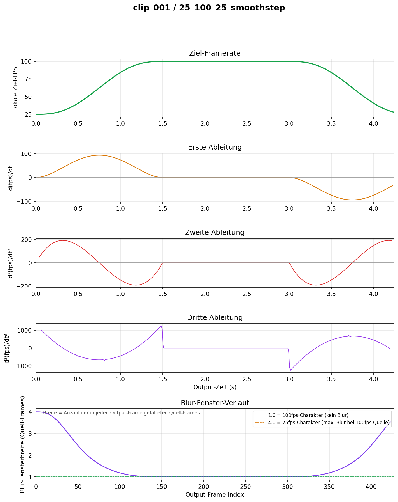

# framerate-ramp-pipeline

Eine Python-Pipeline für **stufenlose Framerate-Rampen** von 100fps-Filmmaterial

HDM Stuttgart — Masterprojekt Cinematography Simon Hans · Betreuer: Jan Fröhlich, Stefan Grandinetti

---

## Transparenzhinweis

Dieses Repository ist im Rahmen meines Masterprojekts entstanden. Bei der praktischen Umsetzung – also beim Schreiben, Refaktorieren und Debuggen des Python-Codes – habe ich Claude als Coding-Assistenten genutzt. Das konzeptionelle Fundament, die mathematische Logik und die Lösungsansätze stammen von mir und wurden im iterativen Prozess gemeinsam mit der KI in lauffähigen Code übersetzt.

Aktueller Stand: Dieses Repository dokumentiert einen funktionierenden Proof-of-Concept (getestet an nativem 100fps-Material).

---

## Kernkonzept

Im Gegensatz zum klassischen Speedramping, bei dem sich die Abspielgeschwindigkeit und Clip-Länge ändern, hält diese Pipeline die Zeitachse konstant (1:1). Jeder Output-Frame entspricht exakt dem Zeitpunkt der Originalaufnahme. Die Pipeline rampt ausschließlich den visuellen Charakter (die Abspielkadenz und die Bewegungsunschärfe).

Die zugrunde liegende Mathematik trennt dabei  die Wiedergabe-Kadenz (hold_count) von der Belichtungszeit (blur_window), welche über den Shutter-Winkel gesteuert wird.

Sei `f_target` die lokale Ziel-Framerate, `f_source` die Quell-Framerate (100fps) und `shutter_angle` der gewünschte simulierte Shutter-Winkel in Grad:

```
blur_window  = (f_source / f_target) * (shutter_angle / 360)
hold_count   = round(f_source / f_target)   ← kein Shutter-Faktor hier
```

**Beispiel:** 25fps mit 180°-Shutter aus 100fps-Material:
- `blur_window = (100/25) * (180/360) = 2.0` → 2 Quell-Frames werden gefaltet (= 1/50s Belichtung)
- `hold_count = round(100/25) = 4` → das Composite wird 4× in den Output geschrieben

`blur_window` und `hold_count` sind bewusst entkoppelt: Der Shutter-Winkel steuert nur die Blur-Intensität, nicht die Wiedergabe-Kadenz.

---

## Installation

### Voraussetzungen

- Python 3.10+
- FFmpeg (systemweit, im PATH)
- NVIDIA-GPU mit CUDA (empfohlen, CPU-Fallback möglich)
- Practical-RIFE Modell ≥ v4.25

### Schritt für Schritt

```bash
# 1. Repository klonen
git clone https://github.com/Simo-de/framerate-ramp-pipeline.git
cd framerate-ramp-pipeline

# 2. Virtual Environment
python -m venv .venv
source .venv/bin/activate        # Windows: .venv\Scripts\activate

# 3. Abhängigkeiten
pip install -r requirements.txt

# 4. PyTorch — Version abhängig von lokaler CUDA-Installation
# GPU (CUDA 12.1):
pip install torch --index-url https://download.pytorch.org/whl/cu121
# CPU-only (langsam, aber ohne GPU lauffähig):
pip install torch --index-url https://download.pytorch.org/whl/cpu

# 5. Practical-RIFE einrichten
cd third_party
git clone https://github.com/hzwer/Practical-RIFE.git practical-rife
# Modell-Checkpoints (RIFE_HDv3.py + flownet.pkl) aus der Model-Liste des
# Repos nach third_party/practical-rife/train_log/ kopieren.
```

---

## Bedienung — konkretes Beispiel

Ziel: Ein 4-sekündiger 100fps-Clip soll von 25fps-Charakter auf 100fps-Charakter und zurück gerampt werden, mit klassischem 180°-Film-Shutter als Ausgangspunkt.

### Schritt 1: Clip exportieren und ablegen

Exportiere den zu rampenden Abschnitt aus deinem Schnittprogramm:
- Format: QuickTime `.mov`, ProRes 4444 oder DNxHR 444
- Framerate: **exakt 100fps** — kein Resampling
- Kein Grading, kein LUT vorab

Lege die Datei hier ab:
```
data/source_100fps/clip_001/clip_001.mov
```

### Schritt 2: Frames extrahieren

```bash
# Das Flag -start_number 0 ist zwingend — ohne es beginnt FFmpeg bei
# frame_000001.png statt frame_000000.png, was die Pipeline erkennt
# und mit einer klaren Fehlermeldung abbricht.
ffmpeg -i data/source_100fps/clip_001/clip_001.mov \
       -start_number 0 \
       data/source_100fps/clip_001/frames/frame_%06d.png
```

Aus einem 4-Sekunden-Clip entstehen so 400 Dateien: `frame_000000.png` bis `frame_000399.png`.

### Schritt 3: Ramp-Preset anlegen

Erstelle `config/ramp_presets/mein_ramp.json`:

```json
{
  "name": "mein_ramp",
  "source_fps": 100,
  "keyframes": [
    { "time_sec": 0.0, "target_fps": 25 },
    { "time_sec": 1.5, "target_fps": 100 },
    { "time_sec": 2.5, "target_fps": 100 },
    { "time_sec": 4.0, "target_fps": 25 }
  ],
  "interpolation": "smoothstep",
  "total_duration_sec": 4.0
}
```

`target_fps` beschreibt den simulierten **Shutter-Charakter**, nicht eine Framerate-Konvertierung. Der Output-Container läuft immer mit 100fps.

### Schritt 4: Pipeline starten

```bash
python -m src.pipeline \
  --clip clip_001 \
  --preset mein_ramp \
  --rife-model-dir third_party/practical-rife/train_log \
  --mode motion_grade \
  --shutter-angle 180
```

Die Pipeline läuft jetzt durch:
1. Frames werden auf Vollständigkeit und korrekten Startindex geprüft
2. Timing-Table wird berechnet
3. Verifikations-Plot wird gespeichert (siehe unten)
4. RIFE rendert die Composites — bei einem 4-Sekunden-Clip ca. 20–40 Minuten (GPU)
5. FFmpeg fügt alles zu einer ProRes-4444-Datei zusammen

Das fertige Video liegt hier:
```
data/output/clip_001_mein_ramp_motion_grade.mov
```

### Wichtige Flags

| Flag | Bedeutung |
|---|---|
| `--mode motion_grade` | Echtes Motion Grading, 1× Geschwindigkeit (Default) |
| `--mode speedramp` | Klassisches Zeitlupen-Retiming |
| `--shutter-angle 180` | Filmischer Look (klassischer 180°-Shutter) |
| `--shutter-angle 360` | Maximaler Blur (360°, passend zu 100fps-Quellmaterial) |
| `--max-subsamples 7` | Qualität des Blur-Integrals (mehr = besser, langsamer) |
| `--force` | Cache löschen und komplett neu rendern |
| `--skip-rife` | Nur Validierung und Plot, kein Render |

---

## Verifikations-Plot — Leseanleitung

Vor jedem Render erzeugt die Pipeline automatisch `verification_plot.png` unter `data/interim/<clip>/ramp_<preset>/`. Er dokumentiert die mathematischen Eigenschaften der Ramp-Kurve.



Der Plot besteht aus fünf Panels:

**Ziel-Framerate**
Die Ramp-Kurve selbst. Sollte S-förmig zwischen 25fps und 100fps verlaufen und an den Übergangspunkten sanft einsetzen 

**Erste Ableitung**
Änderungsrate der Framerate. Zeigt, wie schnell die Rampe steigt oder fällt. An den Plateau-Rändern (wo `target_fps` konstant ist) muss sie gegen Null gehen 

**Zweite Ableitung**
Krümmung der Rampe. Darf betragsmäßig hoch sein (eine steile Rampe ist zwangsläufig stark gekrümmt), muss aber breit und glatt verlaufen — ohne abrupte Richtungswechsel. Ein harter Ausschlag würde bedeuten, dass der Übergang für den Zuschauer spürbar ruckelt.

**Dritte Ableitung**
Der eigentliche Stufenlosigkeits-Beweis. Ein glatter, wellenförmiger Verlauf ohne isolierte Spikes zeigt, dass keine ungewollten Unstetigkeiten in der Kurve vorliegen. Rote Punkte markieren Stellen, deren Amplitude mehr als 25× über dem Median liegt. Bei einem korrekten Quintic-Smootherstep-Übergang sollten keine roten Punkte erscheinen.

**Blur-Fenster-Verlauf**
Zeigt direkt, wie viele 100fps-Quellbilder pro Output-Frame gefaltet werden. Die gestrichelte Linie bei 1.0 markiert 100fps-Charakter (kein Blur), die Linie bei 4.0 markiert maximalen 25fps-Charakter bei 360°-Shutter. Bei 180°-Shutter liegt der Maximalwert bei 2.0.

---

## Architektur

```
framerate-ramp-pipeline/
├── config/ramp_presets/     # Ramp-Kurven als JSON (editierbar, kein Code nötig)
├── data/
│   ├── source_100fps/       # Quellmaterial und extrahierte Frames (lokal, nicht versioniert)
│   ├── interim/             # Timing-Tabellen, gerenderte Frames, Plots (lokal)
│   └── output/              # Fertige MOV-Dateien (lokal)
├── docs/                    # Dokumentations-Assets für README (versioniert)
├── src/
│   ├── ramp_curve.py        # Kurveninterpolation (Smootherstep / Catmull-Rom)
│   ├── timing_table.py      # Kern-Logik: blur_window und hold_count pro Frame
│   ├── rife_interpolator.py # Practical-RIFE Wrapper mit Timestep-Sampling
│   ├── motion_blur.py       # Sub-Frame-Blur-Compositor
│   ├── pipeline.py          # CLI-Entry-Point
│   └── utils/
│       ├── validation.py    # Automatisierte Plausibilitätsprüfungen
│       └── ramp_plotting.py # Verifikations-Plot
├── notebooks/
│   └── ramp_verification.ipynb   # Interaktiver Testlauf ohne RIFE
└── third_party/
    └── practical-rife/      # Separates RIFE-Repo (nicht versioniert)
```

### Generierte Artefakte

Für jeden Clip legt die Pipeline unter `data/interim/<clip>/ramp_<preset>/` ab:

`timing_table.csv` — vollständiges Protokoll: für jeden der N Output-Frames ist dokumentiert, welcher Quell-Anker-Frame genutzt wurde, wie breit das Blur-Fenster war, wie oft das Bild wiederholt wurde und ob es ein Hold-Frame ist. Jeder einzelne Output-Frame ist damit auf den Eingabe-Zeitpunkt zurückverfolgbar.

`verification_plot.png` — statischer Qualitätsnachweis der Kurven-Stetigkeitseigenschaften zum Zeitpunkt der Render-Freigabe.

`blur_frames/` — fertig gerenderte PNG-Sequenz vor dem FFmpeg-Reassembly. Bleibt erhalten, damit der Reassembly-Schritt mit anderen Codec-Einstellungen wiederholt werden kann, ohne RIFE erneut zu starten.

`.render_fingerprint.json` — Konfigurationsnachweis. Die Pipeline prüft bei jedem Start, ob der vorhandene Cache mit der aktuellen Konfiguration übereinstimmt. Bei Abweichungen bricht sie mit einer Fehlermeldung ab. `--force` löscht den Cache und startet sauber neu.

---

## Warum Quintic Smootherstep?

Die naheliegende Implementierung einer Framerate-Rampe wäre eine lineare Interpolation. Oberhauser (2025) zeigt, dass eine unstetige Änderungsrate an den Einsatz- und Ausstiegspunkten als störendes Ruckeln wahrgenommen wird, selbst wenn die Hauptbewegung flüssig ist.

Eine kubische Smoothstep-Funktion (3x² − 2x³) löst das Problem teilweise: Die Steigung an den Segmenträndern ist Null. Aber beim Übergang von einer ansteigenden Rampe in ein konstantes Plateau entsteht ein Sprung in der *zweiten* Ableitung — subtiler, aber wahrnehmbar.

Die Pipeline verwendet daher die **Quintic Smootherstep** nach Ken Perlin (6x⁵ − 15x⁴ + 10x³). Diese Funktion hat an beiden Segmenträndern sowohl erste als auch zweite Ableitung exakt Null. Nicht nur die Steigung, sondern auch die Krümmung des Übergangs klingt sanft aus. Der praktische Effekt: Die Rampe setzt organisch ein und endet, ohne dass ein klar definierbarer Startpunkt wahrnehmbar wird.

Hoydems Arbeit zu lokal variierenden Frameraten (2021) zeigt ergänzend, dass wahrgenommener Judder nicht allein von der Framerate abhängt, sondern von der Diskrepanz zwischen implizierter Belichtungszeit (codiert durch die Blur-Menge) und tatsächlicher Frame-Haltezeit. Das ist der theoretische Kern dieser Pipeline: Blur-Charakter und Wiedergabe-Kadenz werden als unabhängige Parameter behandelt und getrennt gesteuert.

---

## Bekannte Limitierungen

**Ganzzahliger Hold-Count:** Da Monitore nur ganze Bilder anzeigen können, wird `hold_count` auf eine ganze Zahl gerundet. Bei asymmetrischen Zwischenwerten (z.B. 33fps bei 100fps-Quelle: 100/33 = 3,03 → 3) entstehen minimale Timing-Unregelmäßigkeiten. Ob diese wahrnehmbar sind, ist zu prüfen.

**Sub-Frame-Averaging bei Verdeckungen:** Das Averaging behandelt alle RIFE-Samples gleichgewichtig. Bei schnellen Objektbewegungen vor statischem Hintergrund kann die Sampleanzahl unter Umständen nicht ausreichen, um eine nahtlose Bewegungsunschärfe zu erzeugen. In diesen Randfällen ist leichtes Ghosting möglich.

**Skalierung:** Bisher an Kurzclips getestet. Für den Einsatz auf größerem Material empfiehlt sich ein clip-basierter Workflow: Nur die Ramp-Abschnitte aus dem Schnittprogramm exportieren, durch die Pipeline schicken und wieder in die Mastertimeline integrieren.

---

## Literatur

- Hoydem, J. (2020): Locally Varying Frame Rates for Judder Reduction in High-Dynamic-Range Content.
- Oberhauser, L. (2025): Implementierung und Evaluation interpolierter Frame Rate Ramps in Abhängigkeit von Kamera- und Objektbewegung im szenischen Film.
- Huang, Z. et al. (2022): Real-Time Intermediate Flow Estimation for Video Frame Interpolation. (ECCV).
- Perlin, K. (2002). Improving Noise. ACM Transactions on Graphics (TOG), 21(3), 681–682. Abrufbar hier: https://mrl.cs.nyu.edu/~perlin/paper445.pdf

---

*Letzter Stand: 21.07.2026*